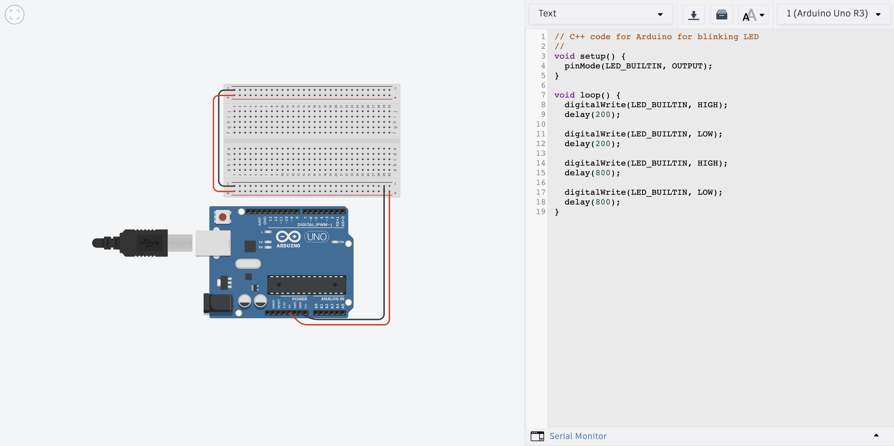

# git-practice
Hello Mission to Mars!
## Story 1: Building the Rover
I found the coding part easy once I got the hang of it. I found setting up git to be extremely hard and I was very confused but it makes sense now. I was also having issues with Arduino but it makes works now after getting some help. I'm so excited to be a part of this project and can't wait to see its outcome! 

