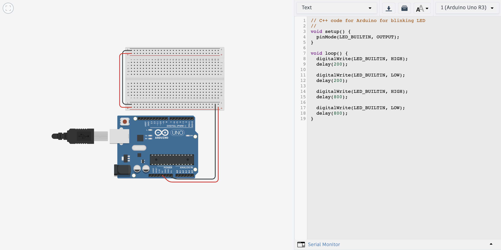
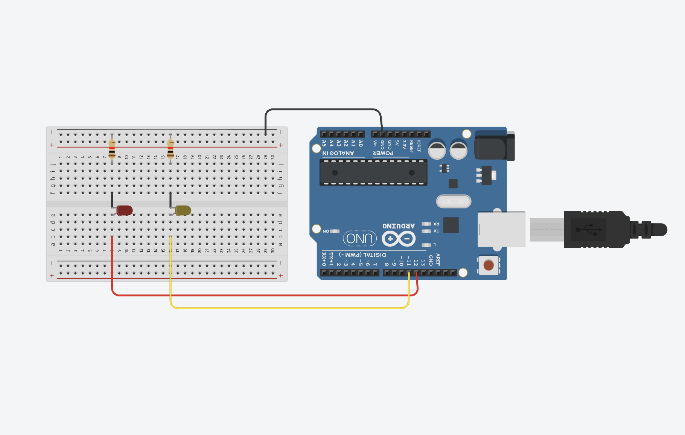
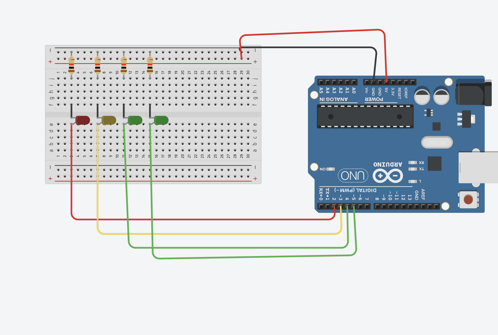
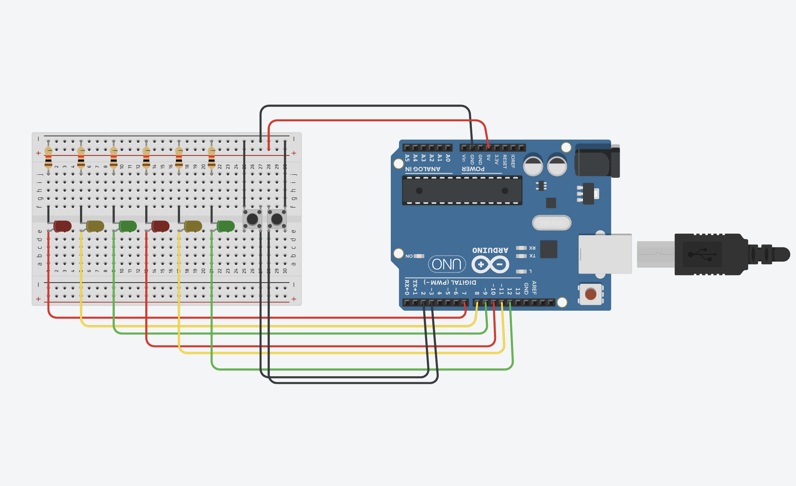
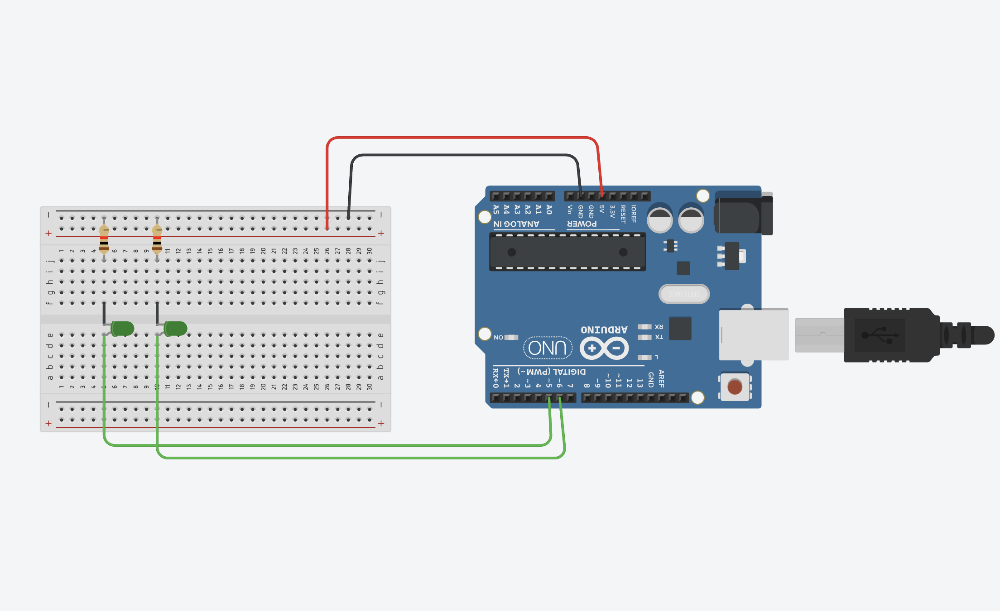

# git-practice
Hello Mission to Mars!
## Story 1: Building the Rover
I found the coding part easy once I got the hang of it. I found setting up git to be extremely hard and I was very confused but it makes sense now. I was also having issues with Arduino but it makes works now after getting some help. I'm so excited to be a part of this project and can't wait to see its outcome! 

## Story 2: Two LEDs Alternating
I duplicated Story 1 in TinkerCad, added a second LED, and modified the code so they alternate every second.I had an issue where there was a short circuit but with some help I figured it out. Both LEDs flash alternately with no overlap. Tested successfully. I am still getting used to git and learning how to push files and the Arduino code onto GitHub but hopefully I get the hang of it!

## Story 3: Motor
It was a challenging task however I believe I have now understood how to push files to Git and to make circuits on TinkerCad. The rover successfully works and meets the acceptance criteria. Story 3 helped me understand how important pin roles are when simulating real hardware. Instead of using LEDs generically, I assigned each one a purpose based on the Arduino motor control layout: power control and direction control for each side of the rover. At first, I hadn’t matched the pins to their real-world functions correctly, which meant my earlier versions didn’t reflect how the rover would actually move. After fixing this, my program now runs the correct sequence—forward for 5 seconds, stop for 1 second, and reverse for 2 seconds in a continuous loop. This made my code more structured and showed me how small wiring and naming decisions affect how a system behaves.

## Story 4: Refactoration
Refactoring the code for Story 4 really changed how I look at the project. In the beginning, I was just focused on getting the LEDs to blink at the right time, but the code looked messy. Moving everything into specific functions like moveForward() and stopRobot() made the whole thing so much easier to read and it actually looks like a set of directions now rather than just a bunch of pin numbers.

## Story 5: Snaking
Working on Story 5 taught me a lot about controlling motor speed. Instead of just turning motors on or off, I used analogWrite to make the robot move at different speeds, which allowed it to curve and snake around. I had to use the correct PWM pins for variable speed, and organizing the code into functions kept it neat. It was really satisfying to see the robot turn smoothly just by slowing one side of the drivetrain.

## Story 6: Interrupts
Working on Story 6 was a big shift in how I think about programming the robot. Up until now, everything was based on timers, but this story forced me to use Interrupts to track actual physical movement. It was definitely a challenge at first my LEDs wouldn't turn off because I had wired both the signal and ground wires to the same side of the button, which meant the Arduino couldn't see the clicks. Once I fixed the wiring to a diagonal setup and used the INPUT_PULLUP feature in the code, it was really satisfying to see the hardware respond to my input in real-time. Instead of just guessing how long 2 meters takes, the robot now stays active until it "feels" the 100th pulse from the sensor. 

## Story 7: Figureof8
Using the same breadboard for the figure-of-eight made the transition from the distance-tracking story much faster. I shifted the logic back to using precise timing specifically that 850ms turn window to nail the 90-degree corners. It was interesting to see how the same hardware setup can perform totally different missions just by changing the software logic from interrupts back to timed loops. Getting the rover to transition from the left-hand square to the right-hand square automatically was a great success.

## Story 8: Dodge
Duplicating the Story 6 circuit was the smartest starting point because it already had the interrupt button wired up. The main difference for Story 8 was adding the extra wires for the reverse LEDs. It felt a bit like a puzzle making sure I didn't plug a motor pin into the same slot as my button pin, but once the reverse' hardware was in place, the board was ready. It’s cool to see how a circuit that just counted pulses before can now be used to trigger a complex safety sequence just by changing the logic in the IDE.

## Story 9: Cliff
Story 9 was about safety. I used the same button interrupt logic, but the response had to be much more permanent. Unlike the obstacle avoidance where the robot continues on, the Cliff Detection code is designed to stop the robot indefinitely after reversing so it doesn't accidentally find another ledge. Watching the Red LEDs pulse for only half a second before everything went dark was a perfect confirmation that the emergency brake and retreat logic were executed exactly as requested.

## Story 10: Poster

